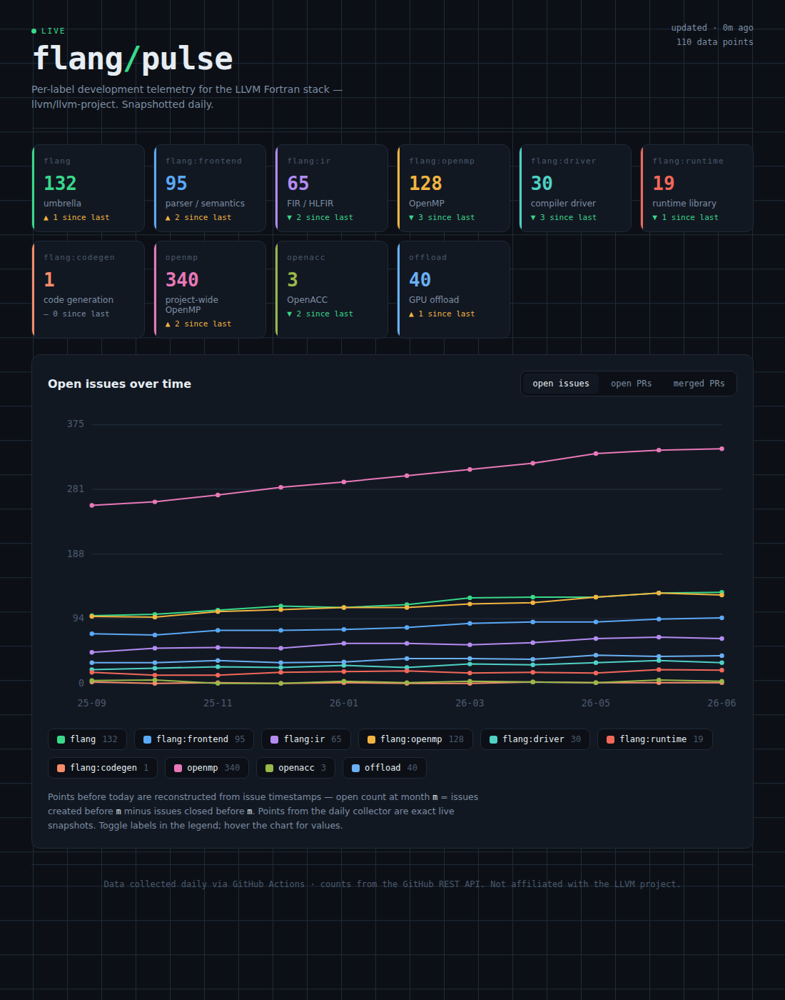

# flang/pulse

A self-updating dashboard that tracks development activity in the
[LLVM](https://github.com/llvm/llvm-project) Fortran stack — per label
(`flang`, `flang:ir`, `flang:openmp`, `openmp`, `openacc`, and so on).

A GitHub Action snapshots issue and PR counts every other day, appends them
to `data/history.json`, and deploys a static site that graphs each metric
over time. No server, no database — the committed JSON *is* the database.



## What it tracks

For every configured label, per snapshot:

- open issues
- closed issues
- open pull requests
- merged pull requests

The site graphs any of these as a multi-line time series, one line per label,
with a metric switcher and a toggleable legend.

## How the history works

GitHub does not store historical counts — the search API only answers
"how many right now." Two mechanisms fill that gap:

1. **Backfill (first run).** For each label, the collector reconstructs
   monthly open-issue history from issue timestamps. The open count at month
   *m* equals issues created before *m* minus issues closed before *m* — an
   exact figure, not an estimate. This populates the graph immediately,
   `BACKFILL_MONTHS` deep (default 18).

2. **Daily snapshots (every run).** Each run records that day's exact counts
   for all four metrics and appends them. Over time the forward history
   becomes a precise daily record. Reconstructed points are flagged
   `"reconstructed": true` so the two are distinguishable.

## Setup

1. **Create a repo** from these files (or fork/copy).

2. **Enable Pages**: Settings → Pages → Source = "GitHub Actions".

3. **Allow the workflow to commit**: Settings → Actions → General →
   Workflow permissions → "Read and write permissions".

4. **First run**: Actions tab → "collect-and-deploy" → "Run workflow".
   The first run does the full backfill, so it takes a few minutes (it makes
   roughly `labels × (BACKFILL_MONTHS + 1) × 2` search calls, paced to stay
   under the rate limit). Subsequent runs add one point each and finish fast.

After that it runs on its own at 06:17 UTC every other day. Your dashboard
lives at `https://<you>.github.io/<repo>/`.

## Configuring labels

Edit `data/labels.json`:

```json
{ "id": "flang:codegen", "name": "flang:codegen", "desc": "code generation", "accent": "#f78c6b" }
```

- `id` — the exact GitHub label (quoted internally, so colons are fine).
- `desc` — shown under the count on the card.
- `accent` — the line/swatch color.

A new label is backfilled automatically on the next run. Removing a label
stops new snapshots; its past data stays in `history.json` until you prune it.

Invalid labels (typos, nonexistent) are reported and skipped rather than
failing the run.

## Running locally

```bash
# collect (needs a token to avoid the ~10 req/min unauthenticated limit)
GITHUB_TOKEN=ghp_xxx python scripts/collect.py

# serve — note the site reads ../data/history.json in this layout
python -m http.server 8000
# open http://localhost:8000/site/index.html
```

## Adjusting cadence

Edit the `cron` in `.github/workflows/collect.yml`. `17 6 */2 * *` is every
other day; `17 6 * * *` is daily. GitHub may delay scheduled runs under load,
which is harmless here — a missed day just means one fewer point.

## What it does not track

Lines added/removed per label is intentionally omitted. GitHub exposes line
deltas per *repository*, not per *label*, so there is no accurate per-label
figure to graph. If you want true per-subdirectory line counts, the honest
source is `git log --numstat -- flang/` against a local clone, which is a
different kind of job than this label-counting collector. It could be added
as a second workflow that clones, runs `git log`, and writes a separate
series — open an issue on your copy if you want to go there.

## Files

```
scripts/collect.py            the collector
data/labels.json              tracked labels (edit this)
data/history.json             accumulated time series (machine-written)
site/index.html               the dashboard (static, no build step)
.github/workflows/collect.yml schedule + commit + Pages deploy
```

Not affiliated with the LLVM project.
